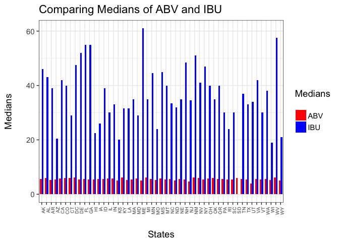
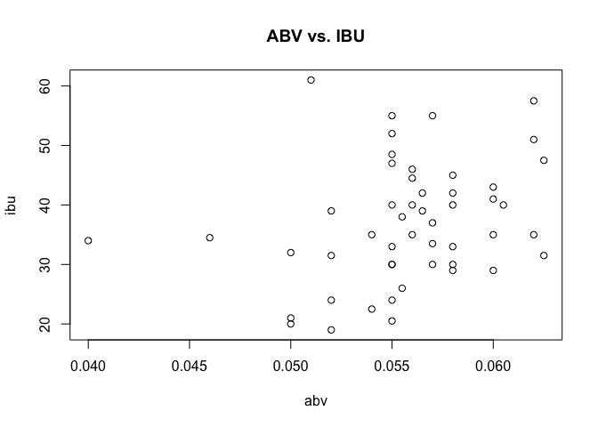

Brewery Information
================
Lizzy Sterling and Andrew Walch
10/10/2017

Introduction
============

The purpose of this code is to take data regarding beer and breweries in the United States of America.
Within this code, you can find information such as:  
\* The number of breweries per state  
\* What data is missing and why this matters in the context of this data  
\* Bitterness and Alcohol content found in each state, along with comparissons  

Libraries used:  
library(dplyr) for the `count` function  
library(ggplot2) for plotting barplot (`ggplot`)  

Reading in the files containing the Beer and the Breweries data in order to conduct further analysis
----------------------------------------------------------------------------------------------------

``` r
knitr::opts_knit$set(root.dir = '/Users/lizzysterling/Desktop/CaseStudy1/Analysis/Data')
```

`beers` contains information regarding the beer data
`breweries` contains information regardin the breweries data

``` r
beers <- read.csv("Beers.csv", header=TRUE)
breweries <- read.csv("Breweries.csv", header=TRUE)
```

Breweries by State
------------------

By using the `count` function within the `dplyr` package, we are able to count the number of breweries found in each separate state.
The state with the most breweries is Colorado (CO) with 47 breweries
The states tied with the least breweries are Washington DC, North Dakota (ND), South Dakota (SD), and West Virginia (WV) with 1 brewery

``` r
count <- count(breweries, breweries$State, sort=FALSE)
names(count)[1] <- "State"
names(count)[2] <- "Breweries"
count_wrap <- cbind(count[1:(nrow(count)/5), ], count[(1+(nrow(count)/5)):(10+(nrow(count)/5)), ], count[(11+(nrow(count)/5)):(20+(nrow(count)/5)),], count[(21+(nrow(count)/5)):(30+(nrow(count)/5)),], count[(31+(nrow(count)/5)):(40+(nrow(count)/5)),])
count_wrap
```

    ##    State Breweries State Breweries State Breweries State Breweries State
    ## 1     AK         7    GA         7    MD         7    NH         3    SC
    ## 2     AL         3    HI         4    ME         9    NJ         3    SD
    ## 3     AR         2    IA         5    MI        32    NM         4    TN
    ## 4     AZ        11    ID         5    MN        12    NV         2    TX
    ## 5     CA        39    IL        18    MO         9    NY        16    UT
    ## 6     CO        47    IN        22    MS         2    OH        15    VA
    ## 7     CT         8    KS         3    MT         9    OK         6    VT
    ## 8     DC         1    KY         4    NC        19    OR        29    WA
    ## 9     DE         2    LA         5    ND         1    PA        25    WI
    ## 10    FL        15    MA        23    NE         5    RI         5    WV
    ##    Breweries
    ## 1          4
    ## 2          1
    ## 3          3
    ## 4         28
    ## 5          4
    ## 6         16
    ## 7         10
    ## 8         23
    ## 9         20
    ## 10         1

Merge beer data with the breweries data.
----------------------------------------

By making the corresponding column names in each data set (`beer` and `brew`)the same, we can merge the data into one large data set `Breweries_and_Beer`
In this case, the corresponding column name referenced the brewery ID, or `Brew_ID`

``` r
names(beers)[5]<- "Brew_ID" #making the merged columns the same
Breweries_and_Beer <- merge(beers, breweries, by="Brew_ID") #brew ID is the only column that they have the same
names(Breweries_and_Beer)[2] <- "BeerName" #changing this column to BeerName
names(Breweries_and_Beer)[8] <- "BreweryName"#changing this coloumn to BreweryName
```

Top 6 lines of the data

``` r
head(Breweries_and_Beer, 6)
```

    ##   Brew_ID      BeerName Beer_ID   ABV IBU
    ## 1       1  Get Together    2692 0.045  50
    ## 2       1 Maggie's Leap    2691 0.049  26
    ## 3       1    Wall's End    2690 0.048  19
    ## 4       1       Pumpion    2689 0.060  38
    ## 5       1    Stronghold    2688 0.060  25
    ## 6       1   Parapet ESB    2687 0.056  47
    ##                                 Style Ounces        BreweryName
    ## 1                        American IPA     16 NorthGate Brewing 
    ## 2                  Milk / Sweet Stout     16 NorthGate Brewing 
    ## 3                   English Brown Ale     16 NorthGate Brewing 
    ## 4                         Pumpkin Ale     16 NorthGate Brewing 
    ## 5                     American Porter     16 NorthGate Brewing 
    ## 6 Extra Special / Strong Bitter (ESB)     16 NorthGate Brewing 
    ##          City State
    ## 1 Minneapolis    MN
    ## 2 Minneapolis    MN
    ## 3 Minneapolis    MN
    ## 4 Minneapolis    MN
    ## 5 Minneapolis    MN
    ## 6 Minneapolis    MN

Bottom 6 lines of the data

``` r
tail(Breweries_and_Beer, 6)
```

    ##      Brew_ID                  BeerName Beer_ID   ABV IBU
    ## 2405     556             Pilsner Ukiah      98 0.055  NA
    ## 2406     557  Heinnieweisse Weissebier      52 0.049  NA
    ## 2407     557           Snapperhead IPA      51 0.068  NA
    ## 2408     557         Moo Thunder Stout      50 0.049  NA
    ## 2409     557         Porkslap Pale Ale      49 0.043  NA
    ## 2410     558 Urban Wilderness Pale Ale      30 0.049  NA
    ##                        Style Ounces                   BreweryName
    ## 2405         German Pilsener     12         Ukiah Brewing Company
    ## 2406              Hefeweizen     12       Butternuts Beer and Ale
    ## 2407            American IPA     12       Butternuts Beer and Ale
    ## 2408      Milk / Sweet Stout     12       Butternuts Beer and Ale
    ## 2409 American Pale Ale (APA)     12       Butternuts Beer and Ale
    ## 2410        English Pale Ale     12 Sleeping Lady Brewing Company
    ##               City State
    ## 2405         Ukiah    CA
    ## 2406 Garrattsville    NY
    ## 2407 Garrattsville    NY
    ## 2408 Garrattsville    NY
    ## 2409 Garrattsville    NY
    ## 2410     Anchorage    AK

Report the number of NAs in each column
---------------------------------------

This is a complete data set with missing values found in the `ABV` and `IBU` columns. This is to be expected because not all beer is alcoholic and not all beer has any bitterness.

``` r
for (i in 1:10){
  print(paste(names(Breweries_and_Beer)[i],":", sum(is.na(Breweries_and_Beer[,i]))))}
```

    ## [1] "Brew_ID : 0"
    ## [1] "BeerName : 0"
    ## [1] "Beer_ID : 0"
    ## [1] "ABV : 62"
    ## [1] "IBU : 1005"
    ## [1] "Style : 0"
    ## [1] "Ounces : 0"
    ## [1] "BreweryName : 0"
    ## [1] "City : 0"
    ## [1] "State : 0"

Compute the median alcohol content and international bitterness unit for each state.
------------------------------------------------------------------------------------

### Median Alcohol Content (ABV) per state

Utah has the least median alcohol content (4%) - this can most likely be attributed to the large population of Mormons in Utah, and Mormons do not typically drink alcohol, especially when it has a higher alcohol content
Kentucky and Washington DC are tied for having the highest median alcohol content (6.25%)

``` r
abv <- tapply(Breweries_and_Beer$ABV, Breweries_and_Beer$State, FUN=median, na.rm=TRUE)
abv
```

    ##     AK     AL     AR     AZ     CA     CO     CT     DC     DE     FL 
    ## 0.0560 0.0600 0.0520 0.0550 0.0580 0.0605 0.0600 0.0625 0.0550 0.0570 
    ##     GA     HI     IA     ID     IL     IN     KS     KY     LA     MA 
    ## 0.0550 0.0540 0.0555 0.0565 0.0580 0.0580 0.0500 0.0625 0.0520 0.0540 
    ##     MD     ME     MI     MN     MO     MS     MT     NC     ND     NE 
    ## 0.0580 0.0510 0.0620 0.0560 0.0520 0.0580 0.0550 0.0570 0.0500 0.0560 
    ##     NH     NJ     NM     NV     NY     OH     OK     OR     PA     RI 
    ## 0.0550 0.0460 0.0620 0.0600 0.0550 0.0580 0.0600 0.0560 0.0570 0.0550 
    ##     SC     SD     TN     TX     UT     VA     VT     WA     WI     WV 
    ## 0.0550 0.0600 0.0570 0.0550 0.0400 0.0565 0.0550 0.0555 0.0520 0.0620 
    ##     WY 
    ## 0.0500

``` r
#max(abv)
#min(abv)
```

### Median International Bitterness Unit (IBU)

Maine (ME) has the highest median of bitterness in their beer of 61
Wisconsin (WI) has the lowest median of bitterness in their beer of 19
*It is interesting to note that South Dakota apparently has no beer with any bitterness*

``` r
ibu <- tapply(Breweries_and_Beer$IBU, Breweries_and_Beer$State, FUN=median, na.rm=TRUE)
#tapply(Breweries_and_Beer$IBU, Breweries_and_Beer$State, FUN=median, na.rm=FALSE)
ibu
```

    ##   AK   AL   AR   AZ   CA   CO   CT   DC   DE   FL   GA   HI   IA   ID   IL 
    ## 46.0 43.0 39.0 20.5 42.0 40.0 29.0 47.5 52.0 55.0 55.0 22.5 26.0 39.0 30.0 
    ##   IN   KS   KY   LA   MA   MD   ME   MI   MN   MO   MS   MT   NC   ND   NE 
    ## 33.0 20.0 31.5 31.5 35.0 29.0 61.0 35.0 44.5 24.0 45.0 40.0 33.5 32.0 35.0 
    ##   NH   NJ   NM   NV   NY   OH   OK   OR   PA   RI   SC   SD   TN   TX   UT 
    ## 48.5 34.5 51.0 41.0 47.0 40.0 35.0 40.0 30.0 24.0 30.0   NA 37.0 33.0 34.0 
    ##   VA   VT   WA   WI   WV   WY 
    ## 42.0 30.0 38.0 19.0 57.5 21.0

#### plot the data in a barchart to compare

The barplot compares, side by side, IBU and ABV medians. When looking at ABV scores, remember that they are in percentages, while IBU is on a scale from 0-120 (roughly). It is apparent that there is greater range for IBUs, but this may be due to the fact that there is also a wide range of taste preferences when it comes to bitterness.

``` r
states <- count[,1]
abv_percent <- abv*100 #making these values percents so that the comparisons are easier to see on the graph
medians <- data.frame(ibu,abv_percent)
#medians
ibu_abv <- data.frame(c(medians$ibu,medians$abv),states)
names(ibu_abv)[1] <- "Medians"
ibu_abv$Measure <- c(rep("IBU",length(ibu)),rep("ABV",length(abv)))
ggplot(ibu_abv,aes(State,Medians)) + geom_bar(aes(State,Medians, fill=Measure),stat="identity",position="dodge",width=.7)+scale_fill_manual("Medians\n", values=c("red","blue"), labels=c("ABV","IBU")) + labs(x="\nStates",y="Medians\n")+ theme_bw(base_size=14) + theme(axis.text.x = element_text(angle=90,hjust=1,size=7)) + ggtitle("Comparing Medians of ABV and IBU") 
```

    ## Warning: Removed 1 rows containing missing values (geom_bar).

 \#\#Comparing States \#\#\#State with the beer with the maximum alcohol content (ABV) Colorado has the beer with highest alcohol content (12.8%)

``` r
abv_clean <- na.omit(Breweries_and_Beer$ABV)
#max(abv_clean)
#Breweries_and_Beer[grep("0.128", Breweries_and_Beer$ABV),]
```

### State with the beer with the maxium bitterness (IBU)

Oregon has the beer with the highest bitterness (138)

``` r
ibu_clean <- na.omit(Breweries_and_Beer$IBU)
#max(ibu_clean)
#Breweries_and_Beer[grep("138", Breweries_and_Beer$IBU),]
```

Summary Statistics for the ABV variable
---------------------------------------

These summary statistics show that there is a large range of alcohol content, with a minimum of .1% and a maximum of 12.8%, with an average of 5.977%.

``` r
summary(abv_clean)
```

    ##    Min. 1st Qu.  Median    Mean 3rd Qu.    Max. 
    ## 0.00100 0.05000 0.05600 0.05977 0.06700 0.12800

Relationship Between IBU and ABV of beer
----------------------------------------

The scatterplot comparing bitterness and alcohol content shows a slight pattern of the higher the alcohol content the higher the bitterness, but there are also many outliers.
The trend of linearity does not start until after you get to 5% alcohol level.

``` r
plot(abv, ibu, main="ABV vs. IBU")
```


